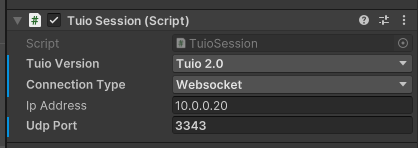
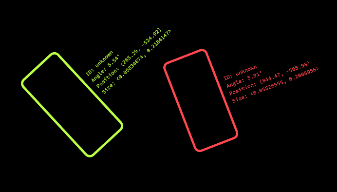
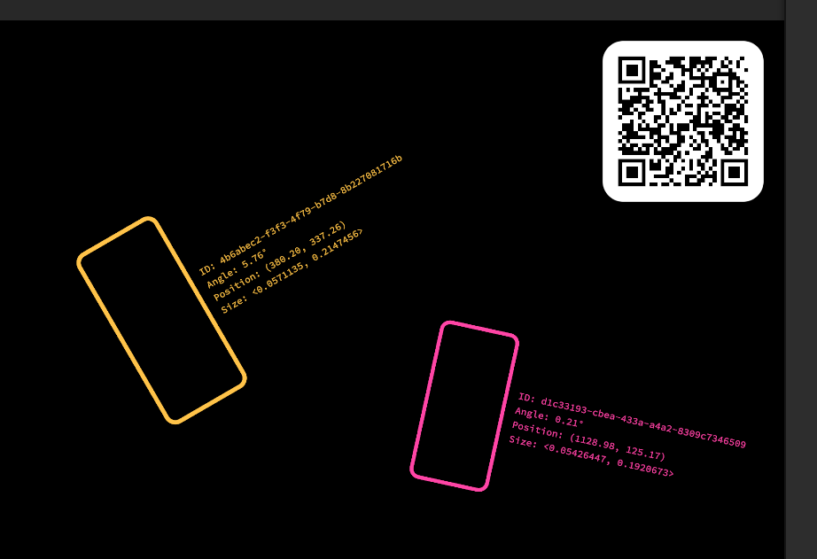
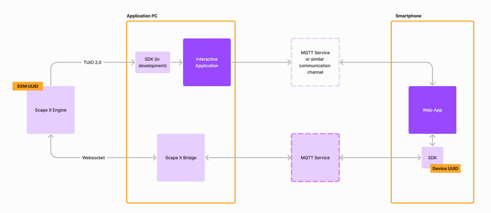
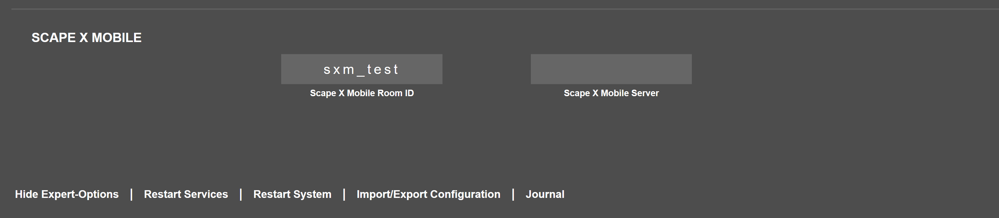
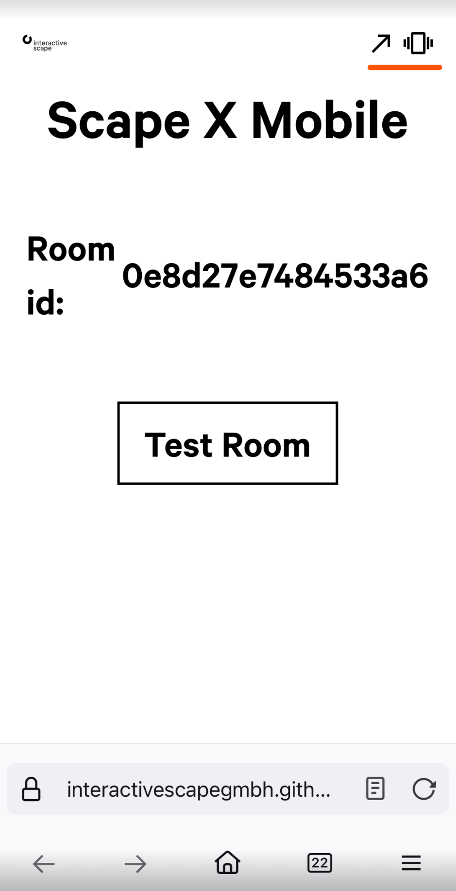
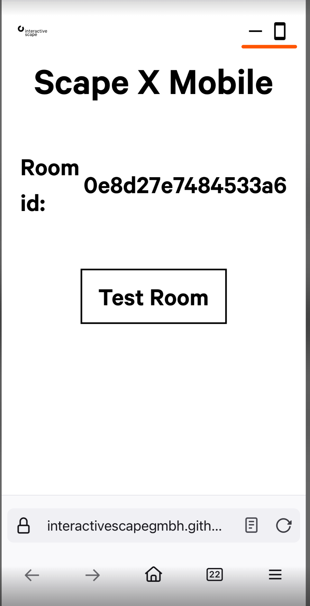

# Scape X Mobile Examples for Unity

In this repository we collect some basic examples how to use our Scape X Mobile technology in applications made with the [Unity](https://unity.com) game engine.

## Setup

The first thing you need to do is to install our [TUIO-Client](https://github.com/InteractiveScapeGmbH/TuioUnityClient) package in order to get touch and object recognition working. For this Example project it is already done.

## Example Scenes

This unity project contains some simple scenes which demonstrates how to set up your project to get Scape X Mobile working.

**Important:** Scape X Mobile only works with TUIO 2.0. So make sure to select the correct version on the `TuioSession` object.



### Basic

This is a basic scene to demonstrate how to set up everything for touch, object and mobile recognition with TUIO 2.0. 

This setup is sufficient if you don't need to know the exact ID of a smartphone and just want to know **if** there is a smartphone on the table and where it is. You can still distinguish different devices by its `SessionId`.




### Unique ID

With this scene it is possible to distinguish different devices on the screen by a unique device id which stays the same even if you lift the device from the screen and put it back on it. 

1. First you need to start `ScapeXMobileMqttDeviceBridge.exe`. This is a small program which is necessary to run because the touch table itself has no connection to the internet. 

2. Press the `Play` button in Unity and scan the QR-Code with your smartphone. This will lead you to a test [webapp](https://interactivescapegmbh.github.io/sxmtest.html).
3. Click `Test Room` (allow the usage for the gyroscope if asked.)
4. Put your smartphone on the touch table. It will now have a unique id which stays the same even if you lift your device up and put it back on the table again.



## How does it work?



The `Scape X Engine` is the software running inside our touch tables. Each table has a unique ID (`SXM UUID`) which by default is the hardware id of the table. You can change this ID in the `Touch & Object Assistant`.
1. Open `10.0.0.20` in your browser
2. At the bottom click `Show Expert-Options`
3. Scroll down to Scape X Mobile
4. Here you can change the Room ID (which is the unique ID) and set a custom MQTT Server Url.



The `Scape X Engine` is responsible for detecting touches, object and smartphones on the touchscreen and sends tuio messages over ethernet to the `Application PC`. The `SDK` mentioned in the overview image is in the case of a unity application the [TuioUnityClient](https://github.com/InteractiveScapeGmbH/TuioUnityClient). 

Every second the `Scape X Engine` also sends a special message which contains the unique ID of the table and the custom MQTT server url (if it was set). The `TuioUnityClient` has a `ScapeXMobile` component for this purpose which registers a `MessageListener` for this special message and raises en event everytime one changes the configuration in the `Touch & Object Assistant`

```csharp
public class ScapeXMobile : MonoBehaviour
{
    public SxmConfig Config { get; private set; }

    /// <summary>
    /// This event gets invoked everytime you change the Scape X Mobile configuration in the Touch & Object Assistant.
    /// </summary>
    public event Action<SxmConfig> OnConfigUpdate;
    
    private const string ScapeXMobileProfile = "/scape_x_mobile/def";

    private void Start()
    {
        var session = GetComponent<TuioSession>();
        var listener = new MessageListener(ScapeXMobileProfile, OnMessage);
        session.AddMessageListener(listener);
    }

    private void OnMessage(OSCMessage message)
    {
        var roomId = (string)message.Values[1];
        var mqttUrl = (string)message.Values[2];

        if (roomId == Config.RoomId && mqttUrl == Config.MqttUrl) return;
        Config = new SxmConfig(roomId, mqttUrl);
        OnConfigUpdate?.Invoke(Config);
    }
}
```

The `Unique ID` sample scene has a `QrUpdater` component which registers on the `OnConfigUpdate` event of the `ScapeXMobile` and updates the QR-Code.

This QR contains the URL to the `Web-App`with parameters for the `Room Id` and an optional parameter for the custom `MQTT Server Url` (if set). 

With this example here we provide a test webapp which does the following:
- The webapp uses the provided `Room Id` and `MQTT Server Url` to connect to the MQTT Server and subscribes to a topic which is the given `Room Id`. 
- It generates a unique id for your smartphone. 
- It uses the gyroscope to detect if the phone is horizontal or vertical and if the phone is in motion or not. (which you can see in the top right corner on the website)

Vertical Moving Phone | Horizontal Stationary Phone
:-------:|:------:
|

- If the smartphone is stationary and horizontal the webapp sends a message with the unique Id of the smartphone to the MQTT Server.

The `Scape X Bridge` is a small software which needs to run in the background if you want to use `Scape X Mobile` with a webapp. This is because the `Scape X Engine` has no connection to the internet. The `Scape X Bridge` has a connection to the `Scape X Engine` via websocket and can read the `Room Id` and the `MQTT Server Url` of the table. With this information it connects to the MQTT Server and also subscribes to the topic with the `Room Id`. So the `Scape X Bridge` gets notified if a smartphone was put on the table.

With the help of the `Scape X Bridge` the `Scape X Engine` gets notified that a smartphone with a certain ID was put down. The `Scape X Engine` can then check if a smartphone was detected recently (within 1s). If so this detected smartphone gets the unique ID.


