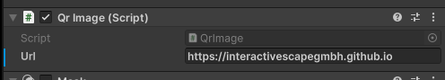

# Scape X Mobile Examples for Unity

In this repository we collect some basic examples how to use our Scape X Mobile technology in applications made with the [Unity](https://unity.com) game engine.

## Setup

The first thing you need to do is to install our [TUIO-Client](https://github.com/InteractiveScapeGmbH/TuioUnityClient) package in order to get touch and object recognition working.

## Example Scenes

This unity project contains three simple scenes which demonstrates how to setup your project to get Scape X Mobile working.

**Important:** Scape X Mobile only works with TUIO 2.0. So make sure to select the correct version on the `TuioSession` object.

### Basic

This is a basic scene to demonstrate how to setup everything for touch, object and mobile recognition with TUIO 2.0. 

This setup is sufficient if you don't need to to know the exact ID of a smartphone and just want to know **if** there is a smartphone on the table and where it is. You can still distinguish different devices by its `SessionId`.

### One Way

With this scene it is possible to distinguish different devices on the screen by a unique device id which stays the same even if you lift the device from the screen and put it back on it. 

For this setup you need two additional components:
- A running `ScapeXMobileMqttDeviceBridge` running in the background.
- A running web app which each device you want to track needs to connect to. In this example this is done by providing a QR code which leads to our test web app (see [github](https://github.com/InteractiveScapeGmbH/InteractiveScapeGmbH.github.io/)). You can set your own url in the `QR Image` component on the QR Prefab.

Once your device has connected to the web app (see documentation) it gets a unique ID which you can see when you place it on the screen.

### Two Way

